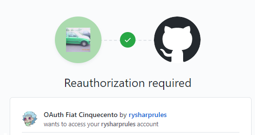

# OAuth Fiat Cinquecento by [rysharprules](https://github.com/rysharprules)
A small sample app to experiment with using OAuth.




## Getting Started
The easiest way to get started is by using the setup script.
```shell script
source setup.sh
```

This will:
- set up your virtual environment
- install all the required dependencies
- create a .env file for your dependencies
- sets up your local database


### Environment Variables
You should already have a `.env` file containing the variables below.
You will need to fill in the missing values with the correct details for your application. 
````dotenv
FLASK_ENV=development       # tells flask that it is running locally
FLASK_DEBUG=false           # toggle flasks 'debug' mode
SECRET_KEY=replace-me       # used by 'flask-login'. Can just be a random string, but should be kept secret (ie not added to source control)
CLIENT_ID=replace-me        # the client id provided by your OAuth provider
CLIENT_SECRET=replace-me    # the client secret provided by your OAuth provider
````

### Using HTTPS locally
OAuth requires that your app uses a secure connection - even when just running locally.
So we need to get that working.

As currently implemented, the app will generate a new certificate to use for this connection every time you start the app.
This is nice and easy (and works fine for OAuth), but the downside is that because the certificate is just one that is
generated by our app, your browser won't trust it.

There are [things you can do about this](https://blog.miguelgrinberg.com/post/running-your-flask-application-over-https) - 
but you can also just ignore your browser's warnings, which is probably the easiest solution in this case.

### Running the app
You should now be able to run the app by running:
```shell script
    flask run
```
from the root of your project directory.

You can then access your application by visiting `https://127.0.0.1:5000/` in your browser.

